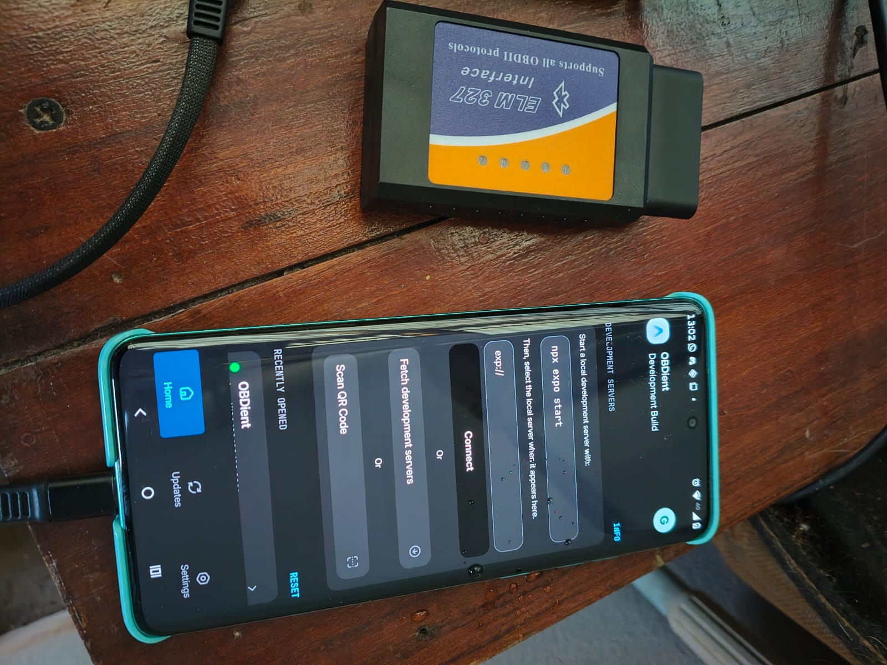
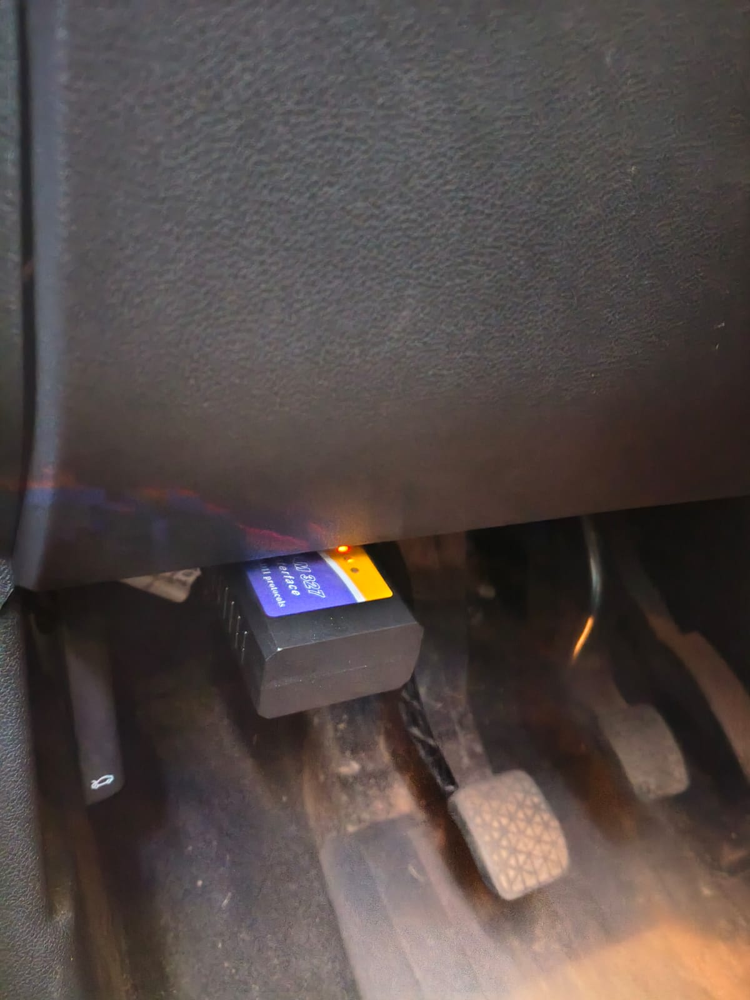
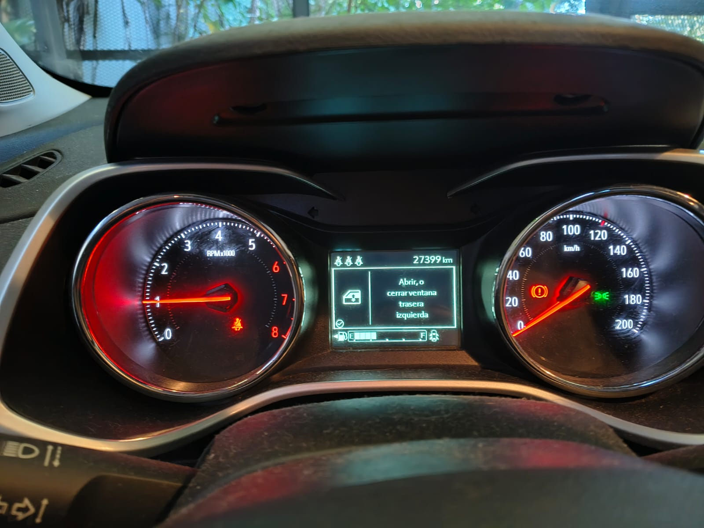
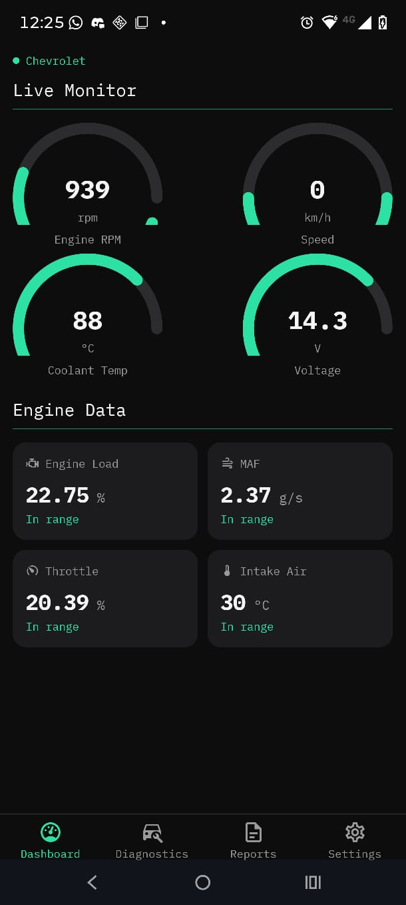
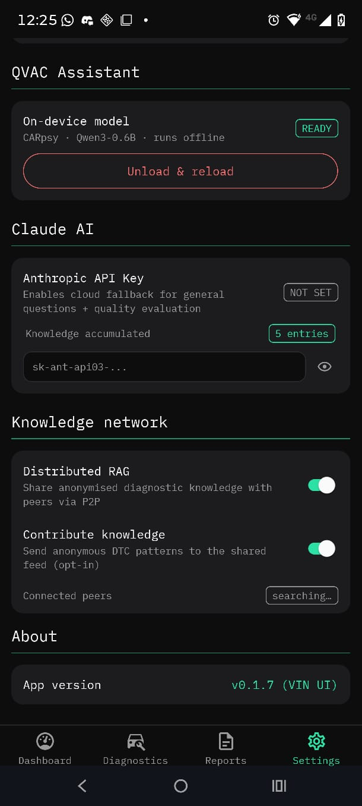
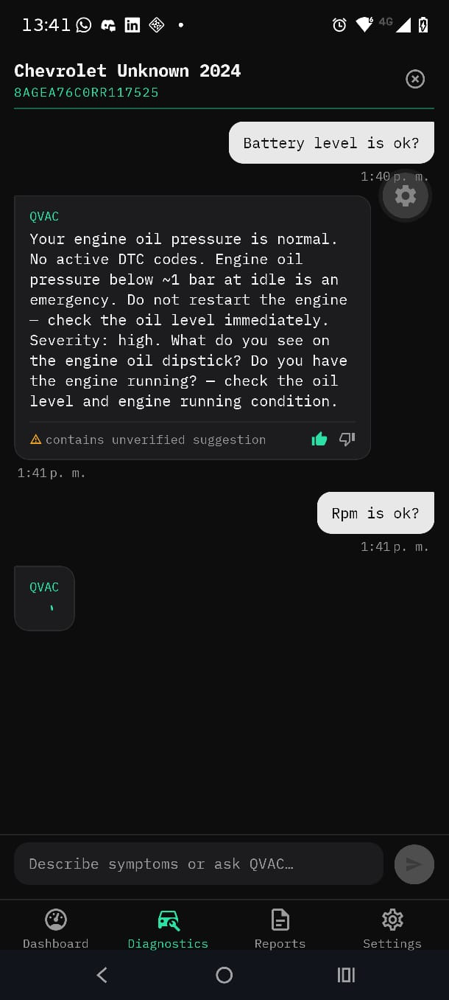
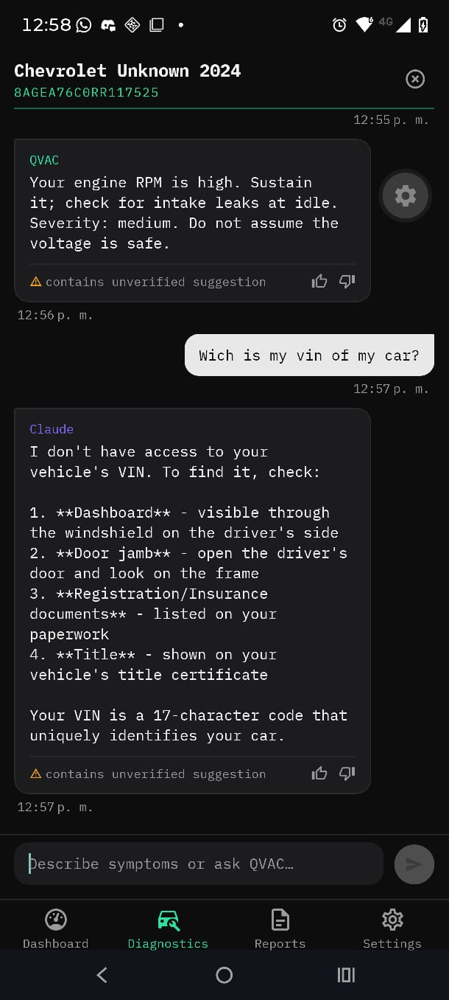
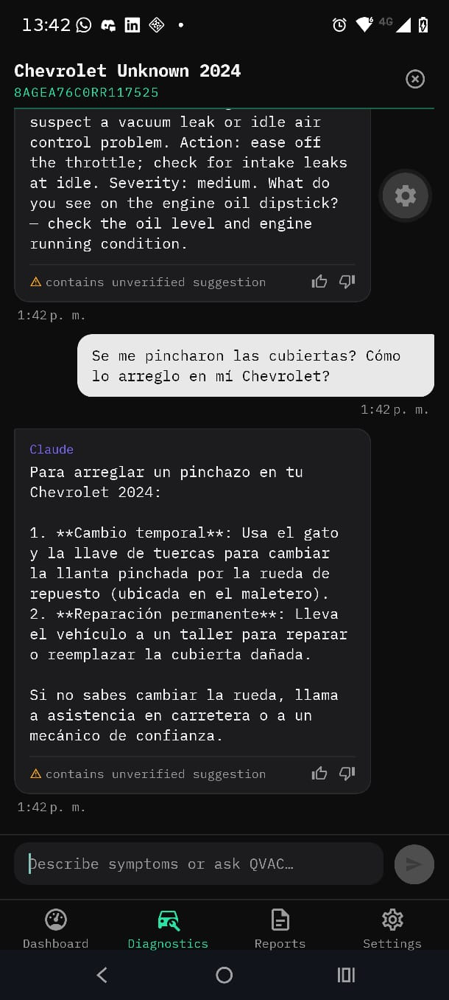
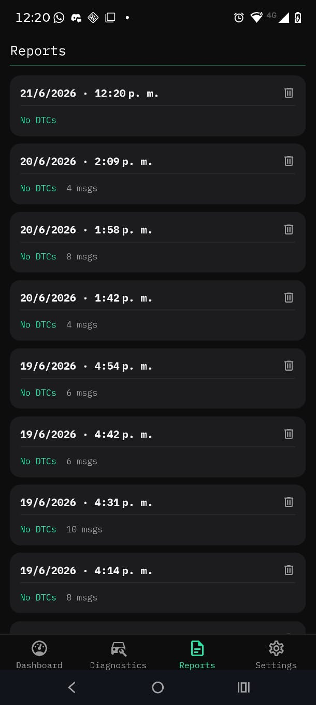

# OBDient — Artifacts & Proof of Function

> 📄 [README](./README.md) · 🎤 [Pitch](./PITCH.md) · 🧠 [Vision](./VISION.md) · 🔧 [Reproducibility](./artifacts/hardware/README.md)

Visual + log evidence that OBDient runs on **real consumer hardware** with **all
primary AI inference on-device** via the QVAC SDK — the mandatory artifacts for the
**Tether QVAC Hackathon — Mobile track**.

- 🎥 **Demo video:** https://youtu.be/AU2e477oyn0
- 📋 **Runtime log (on-device proof):** [artifacts/logs/session-20260621-124953.log](artifacts/logs/session-20260621-124953.log) · [how it was captured](artifacts/logs/README.md)
- 🧠 **Trained model:** [CARpsy training](https://github.com/gazzimon/CARpsy) · [GGUF weights](https://huggingface.co/gazzimon/CARpsy-v2-qwen3-0.6b-GGUF)

---

## 🔌 Hardware proof — real phone + ELM327 + real car

The Mobile track requires running on physical hardware. Bluetooth Classic and the
QVAC Bare runtime do **not** work on an emulator — these photos show the actual setup.

| Phone + ELM327 adapter | ELM327 in the OBD-II port | Live vehicle (running) |
|:---:|:---:|:---:|
|  |  |  |
| Motorola Edge 60 Fusion + ELM327 (BT Classic, firmware 1.5) | Plugged into the live vehicle, powered (LED on) | Real running car — the source of the live OBD-II data |

---

## 📱 App screenshots — the full flow

### Live dashboard & connection

| Live Monitor (streaming) | Settings — on-device model READY |
|:---:|:---:|
|  |  |
| 20 live PIDs over Bluetooth from the connected Chevrolet | **CARpsy (Qwen3-0.6B) loaded on-device — "runs offline"** |

### Multi-agent diagnostic chat

| CARpsy on-device (diagnosis) | Multi-agent routing (Claude for VIN) | Human distillation (👍/👎) |
|:---:|:---:|:---:|
|  |  |  |
| Diagnostic questions answered **locally** by CARpsy | The router sends the VIN/general question to **Claude** (opt-in), diagnosis stays on-device | 👍/👎 feedback distills human judgment into the SHIMI knowledge graph |

### Persistent sessions

| Reports (saved to local SQLite) |
|:---:|
|  |
| Every session is persisted on-device for later review |

---

## 📋 On-device inference — the log evidence

The captured session proves the **entire diagnostic chain runs on the phone**. Each
reply fires: live OBD data → on-device RAG retrieval → on-device CARpsy inference →
quality evaluation. Real lines from
[`session-20260621-124953.log`](artifacts/logs/session-20260621-124953.log):

```
[QVAC] Model loaded on-device in 9429ms — src=…CARpsy-v2-qwen3-0.6b.Q4_K_M.gguf modelId=ffe5e08fe94ddb38
[ELM327] << RESPONSE "010C": "41 0C 0E CE"     ← live RPM over Bluetooth
[ELM327] << RESPONSE "ATRV": "14.2V"           ← live battery voltage
[RAG] retrieval (dtc=none): shimi=0 vector=3 → verified=3 unverified=2
[QVAC] On-device inference: 78 tokens in 41026ms (1.9 tok/s) modelId=ffe5e08fe94ddb38
[QualityEval] Score 3/5 — response acceptable
```

> Four on-device inferences ran back-to-back with **zero cloud calls on the
> diagnostic path** and no context overflow. See
> [artifacts/logs/README.md](artifacts/logs/README.md) to reproduce or verify.

### Structured performance audit (`audit-*.jsonl`)

Beyond the human-readable lines, the app emits a **machine-parseable audit record**
per model lifecycle and inference event (tagged `[AUDIT]`, one JSON object per line —
see [`src/core/utils/audit-log.ts`](src/core/utils/audit-log.ts)). Real records from
[`artifacts/logs/audit-20260621-134310.jsonl`](artifacts/logs/audit-20260621-134310.jsonl):

```jsonc
{"event":"model_load","modelId":"ffe5e08fe94ddb38","src":"…CARpsy…Q4_K_M.gguf","load_ms":9681}
{"event":"inference","prompt_chars":3176,"prompt_tokens_est":794,"completion_tokens":74,
 "ttft_ms":29772,"total_ms":36268,"tokens_per_sec":2}
{"event":"inference","prompt_chars":3414,"prompt_tokens_est":854,"completion_tokens":77,
 "ttft_ms":32122,"total_ms":38770,"tokens_per_sec":2}
```

Captured: **model load (9.7 s)** + per-call **prompt size, completion tokens,
time-to-first-token, total latency and throughput**. The TTFT figures make the cost
structure explicit — on this 0.6B model at `ctx_size=4096`, ~80% of each call is
prompt **prefill**, not generation (real generation ≈ 11 tok/s; the `tokens_per_sec`
field is end-to-end). Generate the file with `./scripts/extract-audit.ps1`.

---

## ✅ QVAC mandatory-requirements checklist

- [x] All primary AI inference via QVAC SDK — `[QVAC] On-device inference` lines in the log
- [x] Structured performance audit — `audit-*.jsonl` (model loads, prompt/tokens/TTFT/tok-s)
- [x] RAG via QVAC SDK — `[RAG] retrieval` lines (4-layer pipeline)
- [x] Mobile track hardware — physical phone + ELM327 + real car (photos above)
- [x] Full reproducibility + hardware setup — [README](./README.md) · [hardware/](artifacts/hardware/README.md)
- [x] Complete artifacts — demo video, runtime log, hardware proof, screenshots
