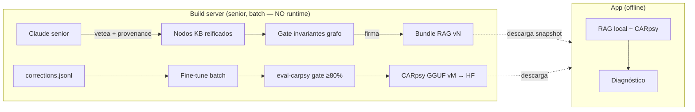

# ADR-0002: Currículo del senior — destilación a CARpsy y RAG central publicado

- **Estado:** Propuesto
- **Fecha:** 2026-06-25
- **Deciders:** Gustavo (gazzimon)
- **Relacionados:** ADR-0001 (nodos reificados que el senior emite con provenance),
  ADR-0003 (distribuye el bundle como seed peer), ADR-0004 (aprendizaje local
  procedural — **complementario**, ver §Alternativas), ADR-0007 (firma de los
  artefactos publicados), PLAN-001 (manifiesto de skill)
- **Repos afectados:** `gazzimon/OBDient` (`claude-api.datasource.ts`,
  `claude-knowledge.datasource.ts`, `qvac-sdk.datasource.ts` model src, pipeline de
  build), `gazzimon/CARpsy` (retrain batch)
- **Influencias externas:** Handilusa/Biomed-AI (`corrections.jsonl`,
  `remote_apis.json`, checklist `EVIDENCE.md`) — adoptadas selectivamente; su
  fine-tuning *on-device* se descarta (ver §Alternativas).

---

## Contexto y problema

El loop "senior enseña al junior" **ya existe**, pero es efímero y vive en cada
dispositivo:

- [`claude-api.datasource.ts`](../../src/data/datasources/claude-api.datasource.ts)
  usa Claude Haiku como senior: `answerGeneral()` responde y `evaluateResponse()`
  audita a CARpsy (score 1–5 + corrección).
- [`multi-agent-chat.ts`](../../src/domain/usecases/multi-agent-chat.ts)
  (`runQualityEval`) guarda la corrección del senior en SHIMI cuando el score < 3.
- [`claude-knowledge.datasource.ts`](../../src/data/datasources/claude-knowledge.datasource.ts)
  la persiste en **MMKV local, máx 500 entradas, evictable**, aislada por
  dispositivo.

El conocimiento que el senior produce **muere en cada teléfono**: no se agrega, no
se vetea de forma central, no vuelve nunca a los pesos del modelo. La mejora de
CARpsy hoy es un proceso manual y desconectado (curar dataset a mano → fine-tune →
subir GGUF a HuggingFace → gate de [`eval-carpsy.js`](../../scripts/eval-carpsy.js)
→ usuarios descargan). No hay corpus compartido autoritativo, ni provenance entre
lo curado y lo aprendido, ni una forma reproducible de versionar el conocimiento.

## Drivers de decisión

- **Offline-first:** el servidor es un *publisher* en build-time, **nunca** una
  dependencia de runtime. La app baja un snapshot y opera 100% offline.
- **Auditabilidad y provenance:** cada nodo de conocimiento cita su fuente; cada
  artefacto es versionado (`knowledgeVersion`) y firmado.
- **Reproducibilidad:** mismo `knowledgeVersion` ⇒ mismo conocimiento; reconstruible
  bit a bit (mismo driver que ADR-0004/0005).
- **Honestidad del touchpoint cloud:** declarar explícitamente el único servicio
  externo (Claude como senior) y qué dato lo cruza y cuál no.
- **No retrain on-device:** preservar el invariante de ADR-0004 (sin fine-tuning en
  el dispositivo).

## Decisión

Movemos el loop senior→junior de *efímero on-device* a un **pipeline de curaduría
central (build-time)** que produce **dos artefactos versionados y firmados** (la
firma se especifica en ADR-0007) que la app descarga y luego usa offline:

### Artefacto 1 — Bundle RAG autoritativo (`knowledgeVersion vN`)

El **agente senior** (Claude, orquestado) toma candidatos —correcciones, sesiones
anonimizadas, chunks de peers que alcanzaron quorum (ADR-0003)— los vetea y **emite
nodos KB reificados** (ADR-0001) **con provenance**: cada nodo cita la fuente de la
que sale. Antes de publicar, el bundle pasa por un **gate de invariantes del grafo**
(todo `broader`/`related` resuelve, todo DTC mapea a un concepto) y se **firma**.

### Artefacto 2 — CARpsy GGUF (`vM`) por destilación batch

El corpus confirmado se exporta como **`corrections.jsonl` append-only** (formato
tomado de Biomed-AI) y alimenta un **fine-tune batch en el build server**. El
resultado pasa el gate de [`eval-carpsy.js`](../../scripts/eval-carpsy.js) (≥ 80% y
TC-04 sin alucinar) antes de publicarse a HuggingFace. El conocimiento "gradúa" de
RAG (rápido de actualizar) a pesos (lento, comprimido).

```
corrections.jsonl (una línea por corrección del senior):
{ "query": "...", "vehicleCtx": "Chevrolet Tracker 2014",
  "carpsy": "<respuesta junior>", "senior": "<corrección>",
  "score": 2, "knowledgeVersion": "vN", "observedAt": <epoch> }
```

### Frontera explícita: el servidor publica, no sirve



### Honestidad del touchpoint cloud

Se adopta de Biomed-AI un manifiesto **`remote_apis.json`** que declara el único
servicio externo (Claude senior), qué recibe (`make/model/year` + pregunta) y qué
**nunca** recibe (VIN, datos de sensores crudos — mismo contrato que
`claude-api.datasource.ts`). Se complementa con un **checklist de verificación**
estilo `EVIDENCE.md` que prueba ejecución on-device, apoyado en los campos que
[`audit-log.ts`](../../src/core/utils/audit-log.ts) ya registra.

## Plan de implementación por fases

- **Fase 0 — Honestidad.** `remote_apis.json` + checklist de verificación. Cero
  cambio de runtime; pura declaración. De-riskea la submission.
- **Fase 1 — Export `corrections.jsonl`.** Volcado append-only desde
  `claude-knowledge.datasource.ts` como dataset candidato. Sin cambio de
  comportamiento.
- **Fase 2 — Pipeline de curaduría del senior.** Bundle RAG firmado `vN` con
  provenance por nodo + gate de invariantes del grafo.
- **Fase 3 — Descarga del bundle.** La app baja el snapshot autoritativo; pasa a ser
  la fuente de conocimiento curado (el MMKV de Claude queda como enriquecimiento
  online opcional, no autoritativo).
- **Fase 4 — Destilación batch.** `corrections.jsonl` → fine-tune → `eval-carpsy`
  gate → GGUF `vM` a HuggingFace.

## Consecuencias

### Positivas
- El conocimiento del senior deja de morir por dispositivo: se agrega, se vetea y se
  versiona de forma central y reproducible.
- Provenance estricta (cada nodo cita su fuente) y firma → auditabilidad total.
- Offline-first intacto: el server publica; la app corre sin red.
- Reusa lo ya construido (Claude senior, `eval-carpsy`, audit-log) sin reescribirlo.

### Negativas / costos
- Aparece infra de build/publish (pipeline + hosting del bundle firmado).
- Disciplina de versionado (`knowledgeVersion`) y manejo de claves de firma.
- La destilación batch tiene latencia de release: el conocimiento "gradúa" a pesos
  con cadencia, no instantáneo.

### Riesgos y mitigaciones
- **El server se vuelve dependencia de runtime** → contrato explícito: solo
  build/publish; la app siempre opera desde el snapshot descargado.
- **Sesgo del senior** → provenance + gate de invariantes + revisión humana antes de
  bumpear `knowledgeVersion`.

## Alternativas consideradas

- **Fine-tuning LoRA *on-device* tras N correcciones (modelo Biomed-AI):**
  descartado. Contradice directamente ADR-0004 §Alternativas ("rompe
  reproducibilidad, caro on-device, mezcla señal estadística con generativa"). El
  retrain de este ADR es **central/batch**, nunca en el dispositivo.
- **Senior en runtime (consultar a Claude en cada query):** descartado. Rompe
  offline-first y manda tráfico por cada diagnóstico. El senior solo actúa en
  build-time; el path online de Claude queda como fallback de preguntas generales,
  no como fuente autoritativa.
- **RAG sin provenance:** descartado. Sin la cita de origen por nodo no se puede
  auditar de dónde sale una sugerencia ni separar curado de aprendido (ADR-0001).
