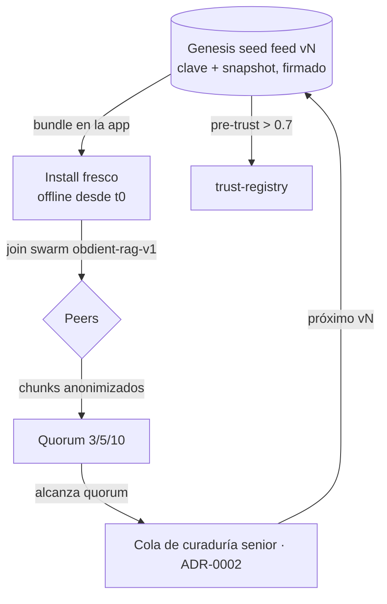

# ADR-0003: Seed peer — bootstrap del conocimiento social P2P

- **Estado:** Propuesto
- **Fecha:** 2026-06-25
- **Deciders:** Gustavo (gazzimon)
- **Relacionados:** ADR-0002 (genera el bundle que el seed distribuye), ADR-0001
  (chunks reificados), ADR-0004/0005 (aprendizaje local — no se federan), ADR-0007
  (firma y rotación de claves, ver §Riesgos)
- **Repos afectados:** `gazzimon/OBDient` (`hypercore-knowledge.datasource.ts`,
  `trust-registry.ts`, bundle de la app, Settings)
- **Influencias externas:** Handilusa/Biomed-AI (inferencia federada con fallback —
  patrón adoptado parcialmente; su transferencia de datos a peers se descarta por
  privacidad, ver §Alternativas).

---

## Contexto y problema

La capa social P2P **ya está casi entera**:

- [`hypercore-knowledge.datasource.ts`](../../src/data/datasources/hypercore-knowledge.datasource.ts)
  — Hypercore + Hyperswarm, topic fijo `obdient-rag-v1`, replicación de feeds,
  opt-in.
- [`trust-registry.ts`](../../src/data/datasources/trust-registry.ts) — reputación
  por peer 0–1 (arranca en `INITIAL_SCORE = 0.3`), gatea la contribución al RAG.
- [`distributed-chunk.ts`](../../src/data/knowledge/distributed-chunk.ts) — 3 capas
  (Fact/Pattern/SkosPatch) con `QUORUM` 3/5/10.

El hueco es el **cold-start de la red**: bajás la app, activás la red, te unís al
topic `obdient-rag-v1`… y te podés encontrar con **cero peers y cero conocimiento**.
La red nace vacía. No hay un ancla de discovery (a quién replicarle), ni un ancla de
confianza (qué conocimiento es autoritativo desde el install). Es el problema
clásico de bootstrap P2P — y, de hecho, está **sin resolver** en proyectos pares
como Biomed-AI (su documentación no explica cómo un install fresco descubre seed
nodes ni se une al swarm). Esto **valida** que el problema es real y diferenciador.

## Drivers de decisión

- **Offline-first:** funciona desde el snapshot bundleado, con cero peers, desde el
  segundo cero.
- **Bootstrap sin servidor en el hot path:** el install fresco sabe a quién
  replicarle sin depender de descubrir peers random.
- **Ancla de confianza:** el conocimiento curado por el senior (ADR-0002) es
  autoritativo desde el install; el resto de los peers **se gana** la confianza.
- **Privacidad:** chunks anonimizados, opt-in — el contrato que `knowledge-extractor`
  y `hypercore-knowledge` ya respetan (sin VIN, sin dirección de adaptador).

## Decisión

La app se distribuye con un **genesis seed** que es **tres cosas a la vez**:

1. **Snapshot bundleado** del RAG autoritativo (el artefacto `vN` de ADR-0002) →
   **funciona offline, con cero peers, desde el install**.
2. **Clave de feed estable** (la public key del feed genesis, en el bundle) → todo
   install fresco sabe a quién replicarle para traer updates. Resuelve el bootstrap
   de discovery.
3. **Ancla de confianza:** el `peerId` del seed entra **pre-trusteado** en
   `trust-registry.ts` en un **tier autoritativo por encima de `HIGH_TRUST_SCORE`
   (0.7)** — hoy todos arrancan en `INITIAL_SCORE = 0.3`; la semilla es la
   excepción. El resto de los peers sigue la curva de reputación/quorum existente.

Los peers extienden encima del seed con el mecanismo `contribute → replicate →
trust → quorum` que **ya existe**. Los chunks de peers que alcanzan quorum
(`QUORUM.fact = 3`, `QUORUM.pattern = 5`) **suben** a la cola de curaduría del
senior (ADR-0002) → entran al próximo `vN` → se redistribuyen por la semilla. El
loop se cierra: **social abajo, senior arriba, semilla en el medio.**

### Infra centralizada, declarada honestamente

Para garantizar discovery, el build server de ADR-0002 corre **un nodo always-on
(pinning)** que replica el feed genesis. Es **la única** pieza de infra
centralizada del sistema social; se declara explícitamente (coherente con el
`remote_apis.json` de ADR-0002). No está en el hot path del diagnóstico: si el
nodo cae, la app sigue operando desde el snapshot y los peers entre sí.

### Frontera con ADR-0002: distribución del GGUF

Hoy el GGUF de CARpsy se baja de HuggingFace (status quo). El QVAC SDK ya acepta
`pear://` como model source ([`qvac-sdk.datasource.ts`](../../src/data/datasources/qvac-sdk.datasource.ts)),
así que **distribuir el modelo por la misma malla P2P es una opción de roadmap**
(Fase 4), no del MVP. Baseline: HuggingFace.

## Plan de implementación por fases

- **Fase 0 — Ancla de confianza + clave.** Tier pre-trusteado en `trust-registry.ts`
  + clave del feed genesis bundleada. Sin snapshot todavía.
- **Fase 1 — Snapshot bundleado.** Empaquetar el RAG `vN` para uso offline
  instantáneo en el install.
- **Fase 2 — Pinning node.** Nodo always-on en el build server para discovery
  garantizado.
- **Fase 3 — Loop de subida.** Chunks de peers a quorum → cola de curaduría del
  senior (ADR-0002).
- **Fase 4 (opcional) — `pear://`.** Distribuir el GGUF por la malla, unificando
  modelo + conocimiento sobre Hypercore.

## Consecuencias

### Positivas
- Mata el cold-start: conocimiento autoritativo y discovery desde el install, con
  cero peers.
- Reusa por completo la malla P2P, el trust-registry y el quorum existentes.
- Cierra el loop con ADR-0002: lo social sube, lo curado baja, todo versionado.
- Diferenciador real frente a proyectos pares que dejan el bootstrap sin resolver.

### Negativas / costos
- El snapshot bundleado agranda el tamaño de la app (a declarar).
- Aparece **una** pieza de infra centralizada (pinning node) — mitigada: fuera del
  hot path, la app degrada con gracia si cae.
- El tier pre-trusteado es una excepción en `trust-registry.ts` que hay que
  mantener con cuidado.

### Riesgos y mitigaciones
- **Clave de semilla pre-trusteada y hardcodeada = punto de centralización y
  artefacto sensible.** Si se compromete, es autoritativa. Mitigación: **firma del
  bundle + rotación de clave** (la app valida la firma antes de confiar). El diseño
  detallado de key-management **se especifica en ADR-0007**.
- **Peer malicioso intenta envenenar el RAG** → ya mitigado por quorum + reputación
  dampeada de `trust-registry.ts`; el seed solo sube el piso de calidad, no relaja
  el gate del resto.

## Alternativas consideradas

- **Inferencia federada (delegar la query a un peer idle, modelo Biomed-AI):**
  descartado por privacidad. Mandar una query/diagnóstico en vivo a un peer expone
  datos del vehículo; el contrato de OBDient es **chunks anonimizados**, no queries.
  Se adopta solo el patrón de **fallback grácil** (degradar a local sin interrumpir).
- **Semilla solo-clave (sin snapshot):** descartado. Sin snapshot, un install sin
  red no tiene conocimiento hasta encontrar un peer; rompe el offline-first del t0.
- **Sin ancla central (descubrir peers puro):** descartado. Es exactamente el cold-
  start que deja la red vacía y sin piso de calidad (el hueco de Biomed-AI).
- **VIN o id de dispositivo como identidad de peer:** descartado. PII; el peerId ya
  es un hash de la public key (sin PII), y así se mantiene.
