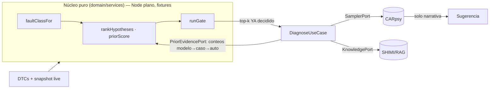

# ADR-0006: Núcleo diagnóstico determinístico con dependencias inyectadas

- **Estado:** Propuesto
- **Fecha:** 2026-06-25
- **Deciders:** Gustavo (gazzimon)
- **Relacionados:** ADR-0001 (nodos reificados / `faultClass`), ADR-0004
  (`rankHypotheses`, determinismo de la ruta de decisión, lazo Beta-Binomial),
  ADR-0005 (identidad de vehículo `vehicleKey` y memoria episódica — el nivel más
  fino del prior jerárquico), ADR-0006-A (satélite — extiende este `DiagnosticContext`
  y este `rankHypotheses` con la evidencia sintomática del usuario como likelihood),
  PLAN-001 (gate determinístico closed-loop — éste es su prerequisito estructural)
- **Repos afectados:** `gazzimon/OBDient` (`domain/services`, `domain/usecases`,
  `domain/ports`, `data/repositories`, `container.ts`, `__tests__`)

---

## Contexto y problema

Hoy la ruta de decisión diagnóstica vive embebida en la capa de datos
([`llm.repository.impl.ts::interpret`](../../src/data/repositories/llm.repository.impl.ts))
y mezcla en un solo método: retrieval (SHIMI/MMKV), red P2P (Hypercore), evaluación
de patrones y la llamada al 0.6B. El sampler (`qvacSDK`) y el acceso a conocimiento
(`shimiDataSource`, `hypercoreKnowledge`) se importan como **singletons concretos**
([llm.repository.impl.ts:5-7](../../src/data/repositories/llm.repository.impl.ts#L5-L7)),
no se inyectan. Consecuencias concretas:

1. **No hay un núcleo importable en Node plano.**
   [`shimi-tree.ts`](../../src/data/knowledge/shimi-tree.ts) ejecuta `createMMKV` en
   el import (L29) y arranca un `setInterval` de decay en el constructor del
   singleton (L300, L315), obligando a mockear `react-native-mmkv` antes de cualquier
   prueba.
2. **El LLM cruza la frontera y *decide* causas**, no solo las narra. No existe
   ranking de hipótesis determinístico (`rankHypotheses` solo vive en ADR-0004 §); el
   `faultClass` está disperso entre
   [`dtcParser.classifySeverity()`](../../src/core/utils/dtcParser.ts#L45-L61) y la
   ontología — deuda que ADR-0001 dejó anotada.
3. **El test de integración no prueba el código de producción:**
   [`stack-integration.test.ts`](../../src/__tests__/stack-integration.test.ts)
   reimplementa el pipeline a mano (L86-L144) y llama a Ollama por HTTP, porque el
   real no es inyectable. Es el síntoma exacto de la falta de inyección.

Esto contradice el driver de auditabilidad/reproducibilidad de ADR-0004/0005 (mismo
input + mismo `knowledgeVersion` ⇒ mismo output) y bloquea el gate de PLAN-001, que
necesita una hipótesis estructurada y un `faultClass` determinístico.

## Drivers de decisión

- **Determinismo y reproducibilidad** de la ruta de decisión (igual que ADR-0004).
- **Testabilidad offline:** el núcleo debe correr contra fixtures sin device, sin
  Bluetooth, sin modelo y sin red.
- **Provenance y separación de capas:** la decisión vive en `domain/`, los efectos en
  `data/`.
- **Reuso del seam que ya funciona:** `IOBDRepository` ya abstrae el transporte; se
  replica ese patrón para sampler y conocimiento.

## Decisión

Adoptamos un **núcleo diagnóstico puro** en `domain/services/diagnostic-core.ts` que
**no importa ningún efecto de borde**, más un **orquestador**
`domain/usecases/diagnose.ts` que recibe sus dependencias por **puertos inyectados**.

### Núcleo puro (sin async, sin I/O — corre en Node plano)

```typescript
// src/domain/services/diagnostic-core.ts
export function faultClassFor(dtc: string): FaultClass;             // consolida dtcParser + ontología
export function faultClassClosure(dtc: string): FaultClass[];       // = ancestors() ya existente (ADR-0001)
export function modelSignatureFor(ctx: DiagnosticContext): string;  // coarsening de caseSignature: solo el modelo
export function hierarchicalPrior(e: PriorEvidence): BetaParams;    // cascada ontología→modelo→caso→auto
export function priorScore(e: PriorEvidence): number;               // media posterior que consume el ranker
export function rankHypotheses(input: RankInput): RankedHypothesis[]; // estable por id (ADR-0004), keyea por priorScore
export function runGate(h: DiagnosticHypothesis, ctx: DiagnosticContext): GateResult; // G1-G6 (PLAN-001 §2)
```

### Puertos inyectables (los efectos quedan afuera del núcleo)

```typescript
// src/domain/ports/sampler.port.ts — reemplaza el singleton qvacSDK directo
export interface SamplerPort { sample(prompt: string, opts?: { maxTokens?: number }): Promise<string>; }

// src/domain/ports/knowledge.port.ts — envuelve shimiDataSource.searchWithProvenance (ya devuelve este shape)
export interface KnowledgePort {
  retrieve(dtcId: string | undefined, query: string, topK?: number): Promise<{
    verified: string[]; unverified: { content: string; query: string }[];
  }>;
}

// src/domain/ports/clock.port.ts — ADR-0004/0005 ya lo asumen
export interface ClockPort { now(): number; }

// src/domain/ports/prior-evidence.port.ts — los CONTEOS viven en SQL (ADR-0004/0005);
// el núcleo recibe el shape ya armado y COMBINA puro. vehicleKey ausente (cold-start de
// identidad, ver ADR-0005) ⇒ nivel `vehicle` = {0,0} y el prior degrada a modelo/caso.
export interface PriorEvidencePort {
  evidenceFor(hypothesisId: string, keys: {
    modelSignature: string;          // derivable de Vincario, NO requiere vehicleKey
    caseSignature: string;           // firma del ADR-0004
    vehicleKey?: string;             // identidad estable del ADR-0005 (opcional)
  }): Promise<PriorEvidence>;
}

// TransportPort NO se crea: ya existe como IOBDRepository. Se reusa.
```

### Frontera explícita: el núcleo decide, el sampler narra



La decisión del top-k **nunca depende del sampler**: el LLM recibe un resultado ya
decidido y solo produce la explicación en lenguaje natural.

### Prior jerárquico determinista (ontología → modelo → caso → vehículo)

El ranking no parte de un prior plano. `rankHypotheses` keyea cada hipótesis por un
`priorScore` que **agrupa evidencia en cuatro niveles de especificidad creciente**,
todos Beta-Binomial. El nivel **modelo** es nuevo respecto del ADR-0004: es el
*coarsening* de `caseSignature` que se queda con `make:model:engine` y **descarta el
DTC y el freeze-frame**, capturando la falla crónica del modelo ("este modelo se come
las bobinas") con mucha más densidad de datos que la firma exacta.

```typescript
// src/domain/services/diagnostic-core.ts — PURO, sin I/O, corre en Node plano.

// Identidad del MODELO: derivable de Vincario/mode 09, NO requiere vehicleKey estable.
// Bucket de año más grueso (6) que el de caseSignature (3): agrupa por generación.
export function modelSignatureFor(ctx: DiagnosticContext): string {
  return sha256(`${ctx.make}:${ctx.model}:${ctx.engine}:${bucket(ctx.year, 6)}`);
}

export interface BetaCounts { confirmed: number; refuted: number; } // éxitos/fracasos del outcome
export interface BetaParams { alpha: number; beta: number; }
export interface PriorEvidence {       // conteos de UNA hipótesis, de general a específico
  ontology: BetaCounts;  // curada (ADR-0001) — base rate global
  model:    BetaCounts;  // (modelSignature, hypId)  — falla crónica del MODELO        ← NUEVO
  case:     BetaCounts;  // (caseSignature, hypId)   — procedural de flota (ADR-0004)
  vehicle:  BetaCounts;  // (vehicleKey, hypId)      — historia de ESTE auto (ADR-0005)
}

// Concentraciones del prior padre (pseudo-conteos). Constantes VERSIONADAS por knowledgeVersion.
const TAU = { model: 8, case: 6, vehicle: 4 } as const;

// Cascada de partial-pooling: el posterior del padre ES el prior del hijo.
// Determinista y reproducible dado (PriorEvidence, TAU, knowledgeVersion). Sin LLM, sin red.
export function hierarchicalPrior(e: PriorEvidence): BetaParams {
  const step = (p: BetaParams, c: BetaCounts, tau: number): BetaParams => {
    const m = p.alpha / (p.alpha + p.beta);                 // media del nivel padre
    return { alpha: tau * m + c.confirmed, beta: tau * (1 - m) + c.refuted };
  };
  let p: BetaParams = { alpha: e.ontology.confirmed + 1, beta: e.ontology.refuted + 1 }; // raíz (Laplace)
  p = step(p, e.model,   TAU.model);    // ontología → MODELO
  p = step(p, e.case,    TAU.case);     // modelo    → caso (flota)
  p = step(p, e.vehicle, TAU.vehicle);  // caso      → este auto
  return p;
}

export function priorScore(e: PriorEvidence): number {
  const { alpha, beta } = hierarchicalPrior(e);
  return alpha / (alpha + beta);        // media posterior (LCB conservador opcional: μ − z·σ, también determinista)
}
```

**Propiedades que esta jerarquía garantiza:**

1. **Especificidad sin historia del auto.** Un auto que se ve por primera vez ya hereda
   la inteligencia de *otros* autos de su modelo: `ontología → modelo` aporta señal aunque
   `case` y `vehicle` estén vacíos. El `modelSignature` sale de Vincario, **antes** de
   resolver `vehicleKey` (ADR-0005). Es el caso de uso que motivó este nivel.
2. **Degradación con gracia, regresión cero.** Sin episodios de este auto
   (`vehicle = {0,0}`) el nivel colapsa a `τ_veh · media(caso)`; sin VIN/identidad estable,
   el orquestador omite `vehicleKey` y el nivel `vehicle` no existe — mismo principio que el
   recall del ADR-0005.
3. **Partial pooling real.** Donde un nivel fino tiene datos abundantes, domina sobre el
   padre; donde es escaso, el padre lo sostiene. No hay salto duro entre "sin datos" y "con datos".
4. **Determinismo preservado.** Es aritmética sobre conteos; mismo input + mismo
   `knowledgeVersion` ⇒ mismo `priorScore`. La frontera "el núcleo decide, el sampler narra"
   se mantiene: el núcleo decide con un prior que **incluye** la historia de modelo y auto,
   calculada sin LLM.

## Plan de implementación por fases

Cada fase es desplegable sola y de-riskea la siguiente (estilo ADR-0004/0005).

- **Fase 0 — `faultClassFor()` puro.** Consolida `dtcParser` + `obd-ontology` en
  `diagnostic-core.ts`. Cero cambio de comportamiento; pura ganancia de testabilidad.
  **Prerequisito de todo.** Riesgo bajo.
- **Fase 1 — `SamplerPort` + `ClockPort`.** `LLMRepositoryImpl` recibe el sampler por
  constructor; `container.ts` inyecta el singleton real. Riesgo bajo.
- **Fase 2 — `KnowledgePort`.** `ShimiDataSource` lo implementa; el núcleo deja de
  importar SHIMI; mover el `setInterval` de decay fuera del import. Riesgo medio.
- **Fase 3 — `rankHypotheses()` + prior jerárquico + `DiagnoseUseCase`.** Mueve la
  frontera de decisión; el sampler pasa a narrar el top-k ya decidido. El prior arranca
  con los niveles **ontología → modelo → caso** (`PriorEvidencePort` + `modelSignatureFor`):
  el nivel **modelo** no depende de identidad estable, así que entrega especificidad sin
  esperar al ADR-0005. A/B con `eval-carpsy.js` antes de mover la frontera. Riesgo medio.
- **Fase 3b — nivel `vehicle` del prior.** Engancha la memoria episódica del ADR-0005
  (`vehicleKey`) como cuarto nivel de la cascada. Llega cuando la identidad estable existe;
  hasta entonces el prior corre con tres niveles sin regresión. Riesgo bajo.
- **Fase 4 — gate G1-G6 (compone con PLAN-001).** `runGate` sobre el núcleo extraído.

## Consecuencias

### Positivas
- Núcleo testeable en Node plano contra fixtures; el caso Tracker se razona sin device.
- Frontera determinístico/IA explícita; reproducibilidad al nivel de ADR-0004.
- Desbloquea el gate de PLAN-001 y el re-ranker de ADR-0004 sobre una base limpia.
- El test de integración pasa a ejercer el código real vía un `FakeSampler`.
- **Prior jerárquico con nivel de modelo:** un auto nunca visto hereda la falla crónica
  de su modelo desde el primer diagnóstico, sin necesidad de identidad estable ni historia
  del auto; la memoria episódica (ADR-0005) refina como cuarto nivel cuando llega.

### Negativas / costos
- Refactor transversal de `container.ts` y de los tests que importan los repos.
- Mover el decay timer cambia el ciclo de vida de SHIMI (riesgo de regresión acotado).
- El ranking determinístico puede ser inicialmente inferior a la prosa del LLM hasta
  calibrarlo.

### Riesgos y mitigaciones
- **El ranking puro rinde peor que el LLM al principio** → A/B con
  [`scripts/eval-carpsy.js`](../../scripts/eval-carpsy.js) antes de mover la frontera
  (Fase 3); si rinde mal, igual se ganó inyección y testabilidad y la frontera se
  mueve gradual.
- **Las concentraciones `τ` (modelo/caso/auto) son hiperparámetros sin calibrar** → son
  constantes **versionadas por `knowledgeVersion`**, así que cualquier cambio queda
  auditado y reproducible; se barren con el mismo `eval-carpsy.js` que el ranking. Defaults
  conservadores (`τ_model` > `τ_case` > `τ_vehicle`) hasta tener datos.
- **Granularidad del `modelSignature`** → `make:model:engine:bucket(year,6)` puede ser
  demasiado fino (poca señal por generación) o demasiado grueso (mezcla generaciones con
  fallas distintas). Es un parámetro del núcleo, testeable contra fixtures; arranca con la
  generación y se ajusta con evidencia, sin tocar la cascada.

## Alternativas consideradas

- **Dejar la decisión en el LLM y testear solo por prompts:** descartado. No es
  reproducible ni auditable; falla el driver de ADR-0004.
- **Materializar ya la tabla `causal_hypothesis` (ADR-0001):** diferido. La ontología
  in-memory da el closure; materializar ahora es una migración Drizzle prematura
  (mismo criterio que PLAN-001 §5).
- **Crear un `TransportPort` nuevo:** innecesario. `IOBDRepository` ya cumple ese rol.
- **Prior plano (un solo nivel) o pooling aditivo con pesos fijos en vez de cascada:**
  descartado. El pooling aditivo (`α = Σ wᵢ·confirmadoᵢ`) no propaga la *incertidumbre* del
  padre al hijo: con datos escasos en un nivel fino, un peso fijo lo trata igual que con
  datos abundantes. La cascada Beta hace shrinkage real hacia el padre proporcional a cuán
  escaso es el hijo — es la formulación correcta de partial pooling y sigue siendo aritmética
  determinista.
- **Meter el nivel de modelo dentro del `caseSignature` (no como nivel aparte):** descartado.
  Es lo que el ADR-0004 ya hace y funde modelo con DTC+condiciones; un Corsa nuevo con un DTC
  nunca visto no recuperaría la falla crónica del modelo. El nivel separado es justamente lo
  que da especificidad sin exigir coincidencia exacta de firma.
