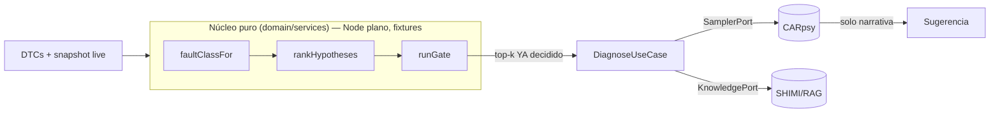

# ADR-0006: Núcleo diagnóstico determinístico con dependencias inyectadas

- **Estado:** Propuesto
- **Fecha:** 2026-06-25
- **Deciders:** Gustavo (gazzimon)
- **Relacionados:** ADR-0001 (nodos reificados / `faultClass`), ADR-0004
  (`rankHypotheses`, determinismo de la ruta de decisión), PLAN-001 (gate
  determinístico closed-loop — éste es su prerequisito estructural)
- **Repos afectados:** `gazzimon/OBDient` (`domain/services`, `domain/usecases`,
  `domain/ports`, `data/repositories`, `container.ts`, `__tests__`)

---

## Contexto y problema

Hoy la ruta de decisión diagnóstica vive embebida en la capa de datos
([`llm.repository.impl.ts::interpret`](../../src/data/repositories/llm.repository.impl.ts))
y mezcla en un solo método: retrieval (SHIMI/MMKV), red P2P (Hypercore), evaluación
de patrones y la llamada al 0.6B. El sampler (`qvacSDK`) y el acceso a conocimiento
(`shimiDataSource`, `hypercoreKnowledge`) se importan como **singletons concretos**
([llm.repository.impl.ts:5-7](../../src/data/repositories/llm.repository.impl.ts#L5-L7)),
no se inyectan. Consecuencias concretas:

1. **No hay un núcleo importable en Node plano.**
   [`shimi-tree.ts`](../../src/data/knowledge/shimi-tree.ts) ejecuta `createMMKV` en
   el import (L29) y arranca un `setInterval` de decay en el constructor del
   singleton (L300, L315), obligando a mockear `react-native-mmkv` antes de cualquier
   prueba.
2. **El LLM cruza la frontera y *decide* causas**, no solo las narra. No existe
   ranking de hipótesis determinístico (`rankHypotheses` solo vive en ADR-0004 §); el
   `faultClass` está disperso entre
   [`dtcParser.classifySeverity()`](../../src/core/utils/dtcParser.ts#L45-L61) y la
   ontología — deuda que ADR-0001 dejó anotada.
3. **El test de integración no prueba el código de producción:**
   [`stack-integration.test.ts`](../../src/__tests__/stack-integration.test.ts)
   reimplementa el pipeline a mano (L86-L144) y llama a Ollama por HTTP, porque el
   real no es inyectable. Es el síntoma exacto de la falta de inyección.

Esto contradice el driver de auditabilidad/reproducibilidad de ADR-0004/0005 (mismo
input + mismo `knowledgeVersion` ⇒ mismo output) y bloquea el gate de PLAN-001, que
necesita una hipótesis estructurada y un `faultClass` determinístico.

## Drivers de decisión

- **Determinismo y reproducibilidad** de la ruta de decisión (igual que ADR-0004).
- **Testabilidad offline:** el núcleo debe correr contra fixtures sin device, sin
  Bluetooth, sin modelo y sin red.
- **Provenance y separación de capas:** la decisión vive en `domain/`, los efectos en
  `data/`.
- **Reuso del seam que ya funciona:** `IOBDRepository` ya abstrae el transporte; se
  replica ese patrón para sampler y conocimiento.

## Decisión

Adoptamos un **núcleo diagnóstico puro** en `domain/services/diagnostic-core.ts` que
**no importa ningún efecto de borde**, más un **orquestador**
`domain/usecases/diagnose.ts` que recibe sus dependencias por **puertos inyectados**.

### Núcleo puro (sin async, sin I/O — corre en Node plano)

```typescript
// src/domain/services/diagnostic-core.ts
export function faultClassFor(dtc: string): FaultClass;             // consolida dtcParser + ontología
export function faultClassClosure(dtc: string): FaultClass[];       // = ancestors() ya existente (ADR-0001)
export function rankHypotheses(input: RankInput): RankedHypothesis[]; // estable por id (ADR-0004)
export function runGate(h: DiagnosticHypothesis, ctx: DiagnosticContext): GateResult; // G1-G6 (PLAN-001 §2)
```

### Puertos inyectables (los efectos quedan afuera del núcleo)

```typescript
// src/domain/ports/sampler.port.ts — reemplaza el singleton qvacSDK directo
export interface SamplerPort { sample(prompt: string, opts?: { maxTokens?: number }): Promise<string>; }

// src/domain/ports/knowledge.port.ts — envuelve shimiDataSource.searchWithProvenance (ya devuelve este shape)
export interface KnowledgePort {
  retrieve(dtcId: string | undefined, query: string, topK?: number): Promise<{
    verified: string[]; unverified: { content: string; query: string }[];
  }>;
}

// src/domain/ports/clock.port.ts — ADR-0004/0005 ya lo asumen
export interface ClockPort { now(): number; }

// TransportPort NO se crea: ya existe como IOBDRepository. Se reusa.
```

### Frontera explícita: el núcleo decide, el sampler narra



La decisión del top-k **nunca depende del sampler**: el LLM recibe un resultado ya
decidido y solo produce la explicación en lenguaje natural.

## Plan de implementación por fases

Cada fase es desplegable sola y de-riskea la siguiente (estilo ADR-0004/0005).

- **Fase 0 — `faultClassFor()` puro.** Consolida `dtcParser` + `obd-ontology` en
  `diagnostic-core.ts`. Cero cambio de comportamiento; pura ganancia de testabilidad.
  **Prerequisito de todo.** Riesgo bajo.
- **Fase 1 — `SamplerPort` + `ClockPort`.** `LLMRepositoryImpl` recibe el sampler por
  constructor; `container.ts` inyecta el singleton real. Riesgo bajo.
- **Fase 2 — `KnowledgePort`.** `ShimiDataSource` lo implementa; el núcleo deja de
  importar SHIMI; mover el `setInterval` de decay fuera del import. Riesgo medio.
- **Fase 3 — `rankHypotheses()` + `DiagnoseUseCase`.** Mueve la frontera de decisión;
  el sampler pasa a narrar el top-k ya decidido. Riesgo medio.
- **Fase 4 — gate G1-G6 (compone con PLAN-001).** `runGate` sobre el núcleo extraído.

## Consecuencias

### Positivas
- Núcleo testeable en Node plano contra fixtures; el caso Tracker se razona sin device.
- Frontera determinístico/IA explícita; reproducibilidad al nivel de ADR-0004.
- Desbloquea el gate de PLAN-001 y el re-ranker de ADR-0004 sobre una base limpia.
- El test de integración pasa a ejercer el código real vía un `FakeSampler`.

### Negativas / costos
- Refactor transversal de `container.ts` y de los tests que importan los repos.
- Mover el decay timer cambia el ciclo de vida de SHIMI (riesgo de regresión acotado).
- El ranking determinístico puede ser inicialmente inferior a la prosa del LLM hasta
  calibrarlo.

### Riesgos y mitigaciones
- **El ranking puro rinde peor que el LLM al principio** → A/B con
  [`scripts/eval-carpsy.js`](../../scripts/eval-carpsy.js) antes de mover la frontera
  (Fase 3); si rinde mal, igual se ganó inyección y testabilidad y la frontera se
  mueve gradual.

## Alternativas consideradas

- **Dejar la decisión en el LLM y testear solo por prompts:** descartado. No es
  reproducible ni auditable; falla el driver de ADR-0004.
- **Materializar ya la tabla `causal_hypothesis` (ADR-0001):** diferido. La ontología
  in-memory da el closure; materializar ahora es una migración Drizzle prematura
  (mismo criterio que PLAN-001 §5).
- **Crear un `TransportPort` nuevo:** innecesario. `IOBDRepository` ya cumple ese rol.
