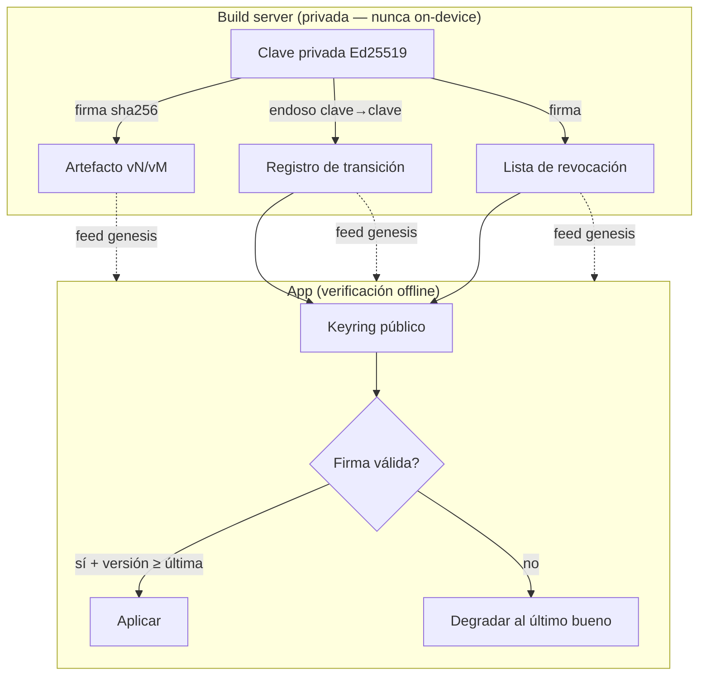

# ADR-0007: Firma y rotación de claves de los artefactos distribuidos

- **Estado:** Propuesto
- **Fecha:** 2026-06-25
- **Deciders:** Gustavo (gazzimon)
- **Relacionados:** ADR-0002 (publica el bundle RAG y el GGUF "firmados"), ADR-0003
  (seed peer pre-trusteado, hardcodeado — §Riesgos pidió este ADR), ADR-0004/0005
  (`knowledgeVersion`, `sourceHash`)
- **Repos afectados:** `gazzimon/OBDient` (`hypercore-knowledge.datasource.ts`,
  `trust-registry.ts`, módulo nuevo de verificación, keyring bundleado), pipeline de
  build (firma)

---

## Contexto y problema

ADR-0002 y ADR-0003 hablan de artefactos **"firmados"** (bundle RAG `vN`, GGUF `vM`,
feed genesis del seed peer) pero **no especifican cómo**. ADR-0003 introduce además
una clave de semilla **pre-trusteada y hardcodeada** y marca explícitamente el
riesgo: *"punto de centralización y artefacto sensible; si se compromete, es
autoritativa"*, difiriendo el diseño a este ADR.

Sin un esquema de firma/rotación concreto quedan tres agujeros:

1. **Autenticidad:** un peer malicioso podría publicar un feed que se haga pasar por
   el genesis y heredar el tier de confianza autoritativo de ADR-0003.
2. **Rotación:** una sola clave hardcodeada no se puede rotar sin **brickear**
   installs viejos (quedarían sin poder verificar el nuevo material).
3. **Revocación:** si la clave privada se filtra, no hay forma de retirarla.

## Drivers de decisión

- **Verificación 100% offline:** la app valida firmas **sin** servidor de claves en
  el hot path (coherente con el offline-first de ADR-0002/0003).
- **Cero secreto en el dispositivo:** la app solo lleva claves **públicas**
  (verificación); la privada vive solo en el build server.
- **Rotación sin update obligatorio de la app:** installs viejos deben poder aprender
  una clave nueva por continuidad de confianza.
- **Conservadurismo:** la revocación solo **achica** la confianza, nunca la expande.
- **Reuso del primitivo del stack:** Hypercore ya identifica peers por su clave
  pública; usar la misma familia evita introducir criptografía ajena.

## Decisión

### Firma asimétrica Ed25519, verificación-solo en el dispositivo

Cada artefacto publicado (bundle RAG `vN`, GGUF `vM`, cada append al feed genesis)
lleva una **firma detached Ed25519 sobre el `sha256` de su contenido** —el mismo
`sourceHash`/`knowledgeVersion` que ADR-0004/0005 ya computan. La **clave privada de
firma vive solo en el build server** (infra build-time, nunca on-device, misma
postura que ADR-0002). La app verifica la firma **antes** de aplicar o confiar en el
material; si falla, **degrada al último material bueno** (nunca aplica sin verificar).

### Keyring bundleado (no una sola clave) → habilita rotación

La app no lleva *una* clave sino un **keyring**: un conjunto chico de claves públicas
ancla, embebido en el bundle. El seed peer de ADR-0003 entra al tier autoritativo de
`trust-registry.ts` **solo si su feed valida contra una clave del keyring**.

### Rotación por continuidad de confianza (offline)

Para rotar sin update obligatorio: el build server publica un **registro de
transición** firmado por la **clave vieja** que **endosa la clave nueva**
(`{ newPubKey, validFrom, sig_by_old }`). Un install que ya confía en la vieja
**aprende** la nueva por esa cadena, sin pasar por la tienda de apps. Ventanas de
validez **solapadas**: la vieja sigue válida durante el overlap y luego se deja caer.

### Revocación (CRL-lite, monótona)

Una **lista de revocación firmada** se distribuye por el mismo feed. La app retira
toda clave revocada. La revocación es **monótona**: solo quita confianza. Para evitar
downgrade attacks, `knowledgeVersion` es **monótona creciente** y la app **rechaza**
material firmado con versión anterior a la última aplicada.

## Plan de implementación por fases

- **Fase 0 — Keypair + keyring.** Generar la keypair Ed25519; embeber el keyring
  público en la app. Declarar el formato de firma. Aún no se firma nada.
- **Fase 1 — Firmar bundle + GGUF.** La app verifica antes de aplicar; firma inválida
  ⇒ degrada al último material bueno.
- **Fase 2 — Feed genesis firmado.** El pre-trust de ADR-0003 se gatea por firma
  válida contra el keyring.
- **Fase 3 — Rotación.** Registros de transición (vieja endosa nueva) + ventanas
  solapadas.
- **Fase 4 — Revocación.** Lista firmada + rechazo de `knowledgeVersion` regresiva.

## Consecuencias

### Positivas
- Autenticidad de todo el material distribuido, verificable offline.
- Cero secreto en el dispositivo; la clave privada nunca sale del build server.
- Rotación y revocación sin brickear installs ni forzar update de la app.
- Cierra el riesgo que ADR-0003 dejó abierto sobre la clave del seed.

### Negativas / costos
- Custodia disciplinada de la clave privada en el build server (idealmente HSM/secret
  manager); su compromiso es el peor caso.
- Manejo de keyring + ventanas de validez agrega superficie de estado.
- La app debe manejar con gracia los fallos de verificación (camino de degradación).

### Riesgos y mitigaciones
- **Filtración de la clave privada** → revocación + rotación; ventanas solapadas
  acotan el daño; el material viejo firmado por la clave revocada se rechaza.
- **Downgrade attack** (re-servir un `vN` viejo) → `knowledgeVersion` monótona; la app
  rechaza versiones anteriores a la última aplicada.
- **Verificación no necesita reloj** → no se introduce dependencia temporal en la
  ruta de verificación (las ventanas se evalúan contra `knowledgeVersion`, no contra
  `Date.now()`).

## Alternativas consideradas

- **Una sola clave hardcodeada (sin keyring):** descartado. Es justo el punto frágil
  que ADR-0003 marcó: no se puede rotar sin brickear installs.
- **PKI/TLS con CA:** descartado. Overkill para este caso; arrastra una CA y, en la
  práctica, validación online — rompe el offline-first.
- **Claves simétricas (HMAC):** descartado. No se puede embeber el verificador en la
  app sin filtrar también el firmante.
- **Servidor de claves consultado en runtime:** descartado. Mete una dependencia de
  red en el hot path; contradice ADR-0002/0003.
